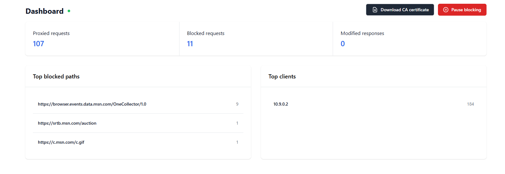
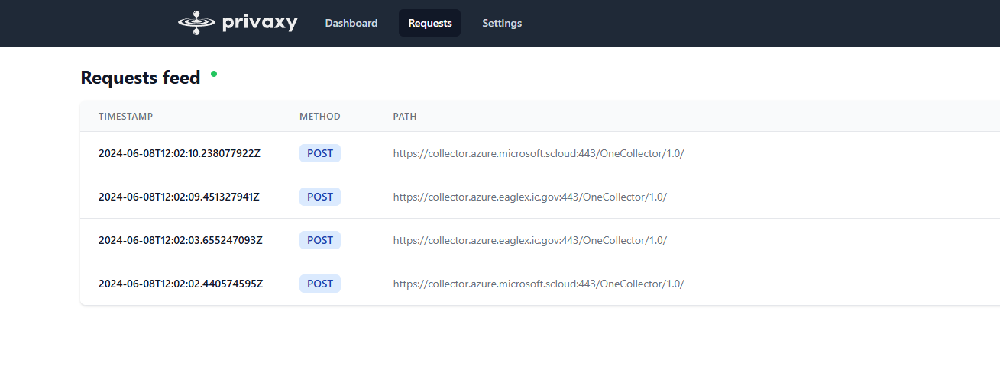
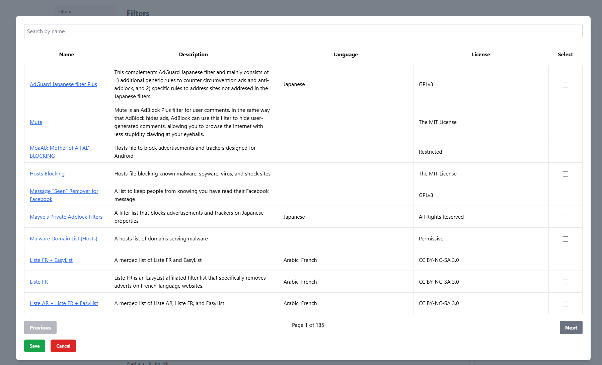

  

  <h1>Privaxy</h1>

  

    <strong>Next generation tracker and advertisement blocker</strong>
  

**Forked from the [app version](https://github.com/Barre/privaxy/tree/v0.5.2)**

This reverts it back to [v0.3.1](https://github.com/Barre/privaxy/tree/v0.3.1), but with
newer updates, an improved UI, and server-friendly configuration. To skip to the differences,
[see here](#differences)

See pending features [here](#todo)

**TODO: more screencaps**

## About

Privaxy is a MITM HTTP(s) proxy that sits in between HTTP(s) talking applications, such as a web browser and HTTP servers, such as those serving websites.

By establishing a two-way tunnel between both ends, Privaxy is able to block network requests based on URL patterns and to inject scripts as well as styles into HTML documents.

Operating at a lower level, Privaxy is both more efficient as well as more streamlined than browser add-on-based blockers. A single instance of Privaxy on a small virtual machine, server or even, on the same computer as the traffic is originating from, can filter thousands of requests per second while requiring a very small amount of memory.

Privaxy is not limited by the browser’s APIs and can operate with any HTTP traffic, not only the traffic flowing from web browsers.

Privaxy is also way more capable than DNS-based blockers as it is able to operate directly on URLs and to inject resources into web pages.

## Features

- Suppport for [Adblock Plus filters](https://adblockplus.org/filter-cheatsheet), such as [easylist](https://easylist.to/).
- Web graphical user interface with a statistics display as well as a live request explorer.
- Support for uBlock origin's `js` syntax.
- Support for uBlock origin's `redirect` syntax.
- Support for uBlock origin's scriptlets.
- Browser and HTTP client agnostic.
- Support for custom filters.
- Support for excluding hosts from the MITM pipeline.
- Support for protocol upgrades, such as with websockets.
- Automatic filter lists updates.
- Very low resource usage.
  - Around 50MB of memory with approximately 320 000 filters enabled.
  - Able to filter thousands of requests per second on a small machine.

## TODO

- General
  - Documentation
  - Verify dpkg works as expected
- Web GUI
  - [x] Ability to add custom filters
  - [x] [filterlists.com](https://filterlists.com) integration
  - [x] Change bind settings
  - [x] TLS on the web gui
  - [ ] Authentication to the web gui
  - [ ] Update configuration from the gui
- Backend
  - [x] Bind to different addresses and ports
  - [x] Specify path or CA cert in config
  - [x] Update ublock dependencies
  - [x] Patch NotValidBefore on generated certificates
  - [ ] Fix cloudflare/robot checks?
  - [ ] Update dependencies
  - [ ] Implement systemctl signal handling
  - [ ] Figure out which syntaxes the adblock engine supports
  - [ ] Improve logging
  - [ ] Utilize uAsset website
- Future
  - Add DNS resolutions; incoporate DNS level blocking?

## Installation

### Using a pre-built binary

**TODO**

## Differences

- You can now specify the address to bind to in the toml config
- You can use environment variables to specify the folder to store the config
- **Adding of custom filters from external sources.** I've added an integration
  to https://filterlists.com in the web gui to search and add filters from there.
- **NotValidBefore** patched properly, slight time differences *will not* produce
  invalid cert messages.
- Static files and API now bind to same port

**TODO** more info, screenshots